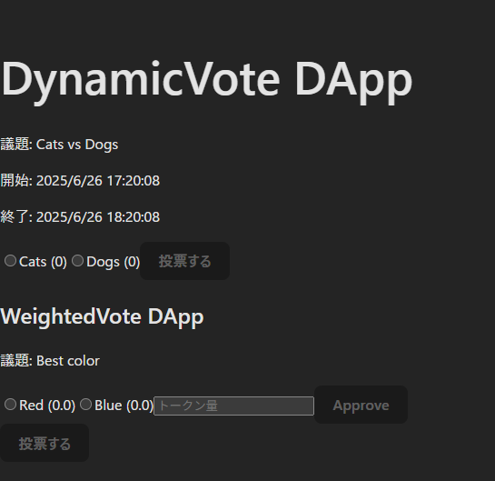

<<<<<<< HEAD
# SimpleVote

簡単な投票システムを学習用にまとめたリポジトリです。Hardhat で Solidity コントラクトを管理し、React 製のフロントエンドから投票を行います。

## 特徴

- **DynamicVote**: 選択肢を後から追加できる投票コントラクト
- **WeightedVote**: ERC20 トークンを預けて投票数に重み付けを行う拡張版
- **PollManager**: DynamicVote か WeightedVote を生成して一覧管理する
- **simple-vote-ui**: 上記コントラクトを操作する React アプリ

## ディレクトリ構成

```
contracts/          Solidity コントラクト
scripts/            デプロイスクリプト
simple-vote-ui/     フロントエンド
```

## 事前準備

1. Node.js 18 以上をインストールしてください。
2. ルートに `.env` ファイルを作成し、以下を設定します。

```
API_URL=<RPC エンドポイント>
PRIVATE_KEY=<デプロイに使用する秘密鍵>
```

## セットアップ

```bash
npm install
```

## コンパイル・テスト

```bash
npm run compile
npm test
```

## コントラクトデプロイ

このリポジトリでは Polygon の Amoy テストネットを `amoy` ネットワークとして設定しています。
`.env` には Amoy の RPC URL とデプロイに使用する秘密鍵を入力してください。
準備ができたら以下のコマンドでデプロイを実行します。

```bash
npx hardhat run scripts/deploy.js --network amoy
```

## フロントエンドの起動

```bash
cd simple-vote-ui
npm install
npm run dev
```

ブラウザで表示された URL にアクセスすると、Metamask 等のウォレットを使ってコントラクトを操作できます。`npm run lint` で ESLint を実行できます。

## 使い方

1. 上記の手順でフロントエンドを起動したら、表示された URL をブラウザで開きます。
2. 「ウォレット接続」ボタンを押して MetaMask などのウォレットと接続します。
3. 投票したい選択肢を選び、「投票する」をクリックします。
4. 投票済みの場合は「取消」ボタンで取り消せます。
5. WeightedVote の画面では、投票前にトークン量を入力して「Approve」を実行してください。

<!-- スクリーンショット挿入位置 -->


## ライセンス

本プロジェクトは MIT ライセンスの下で公開されています。
=======
# SimpleVote

簡単な投票システムを学習用にまとめたリポジトリです。Hardhat で Solidity コントラクトを管理し、React 製のフロントエンドから投票を行います。

## 特徴

- **DynamicVote**: 選択肢を後から追加できる投票コントラクト
- **WeightedVote**: ERC20 トークンを預けて投票数に重み付けを行う拡張版
- **simple-vote-ui**: 上記コントラクトを操作する React アプリ

## ディレクトリ構成

```
contracts/          Solidity コントラクト
scripts/            デプロイスクリプト
simple-vote-ui/     フロントエンド
```

## 事前準備

1. Node.js 18 以上をインストールしてください。
2. ルートに `.env` ファイルを作成し、以下を設定します。

```
API_URL=<RPC エンドポイント>
PRIVATE_KEY=<デプロイに使用する秘密鍵>
```

## セットアップ

```bash
npm install
```

## コンパイル・テスト

```bash
npm run compile
npm test
```

## コントラクトデプロイ

このリポジトリでは Polygon の Amoy テストネットを `amoy` ネットワークとして設定しています。
`.env` には Amoy の RPC URL とデプロイに使用する秘密鍵を入力してください。
準備ができたら以下のコマンドでデプロイを実行します。

```bash
npx hardhat run scripts/deploy.js --network amoy
```

## フロントエンドの起動

```bash
cd simple-vote-ui
npm install
npm run dev
```

ブラウザで表示された URL にアクセスすると、Metamask 等のウォレットを使ってコントラクトを操作できます。`npm run lint` で ESLint を実行できます。

## 使い方

1. 上記の手順でフロントエンドを起動したら、表示された URL をブラウザで開きます。
2. 「ウォレット接続」ボタンを押して MetaMask などのウォレットと接続します。
3. 投票したい選択肢を選び、「投票する」をクリックします。
4. 投票済みの場合は「取消」ボタンで取り消せます。
5. WeightedVote の画面では、投票前にトークン量を入力して「Approve」を実行してください。

<!-- スクリーンショット挿入位置 -->


## ライセンス

本プロジェクトは MIT ライセンスの下で公開されています。
>>>>>>> main
