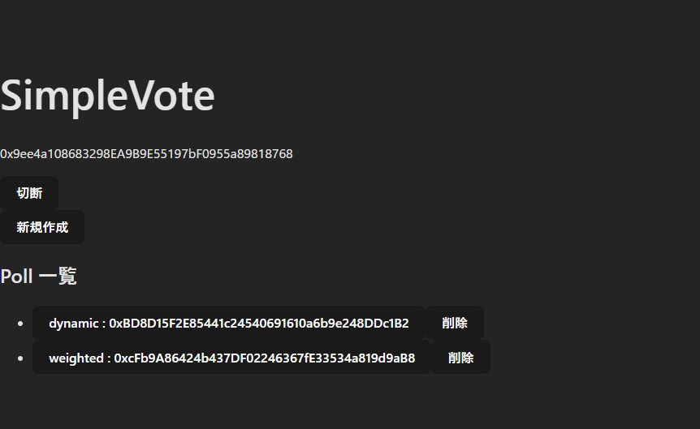

# SimpleVote

Solidity と React を使ったシンプルな投票（dApp）のサンプルプロジェクトです。スマートコントラクト開発フレームワーク Hardhat を利用して、各種コントラクトのコンパイル・テスト・デプロイを管理します。

## 主な特徴

-   **3種類の投票コントラクト**:
    -   `SimpleVote`: 「賛成/反対」のみの最もシンプルな投票です。
    -   `DynamicVote`: オーナーが選択肢を後から自由に追加できる、より柔軟な投票です。
    -   `WeightedVote`: `DynamicVote`を拡張し、ERC20 トークンを預けることで投票に重み付けができます。
-   **投票管理コントラクト**:
    -   `PollManager`: 上記の投票コントラクトを新規に生成し、一覧を管理します。
-   **React フロントエンド**:
    -   `simple-vote-ui`: Vite で構築された React アプリケーションから、MetaMask を通じて各コントラクトを操作できます。

## 技術スタック

-   **スマートコントラクト**: Solidity, Hardhat, OpenZeppelin Contracts
-   **フロントエンド**: React, Vite, ethers.js, Tailwind CSS (CSSは今後導入予定)
-   **テスト**: Chai, Mocha (Hardhat Toolbox)

## ディレクトリ構成

```
contracts/          Solidity で書かれたスマートコントラクト
scripts/            デプロイ用スクリプト
test/               コントラクトのテストコード
simple-vote-ui/     React 製フロントエンド
```

## 事前準備

1.  Node.js 18 以上をインストールしてください。
2.  リポジトリのルートに `.env` ファイルを作成し、以下の内容を参考に設定します。

```
# Polygon Amoy テストネットなど、接続したいネットワークの RPC エンドポイント
API_URL="https://rpc-amoy.polygon.technology/"

# コントラクトのデプロイに使用するアカウントの秘密鍵
PRIVATE_KEY="YOUR_PRIVATE_KEY"
```

## セットアップ

プロジェクト全体の依存パッケージをインストールします。

```bash
npm install
```

## コンパイルとテスト

Solidity のコードをコンパイルし、テストを実行します。

```bash
# コンパイル
npm run compile

# テスト
npm test
```

## コントラクトのデプロイ

このリポジトリでは Polygon の Amoy テストネットを `amoy` ネットワークとして設定済みです。`.env` ファイルに必要な情報を設定した後、以下のコマンドでデプロイを実行します。

```bash
npx hardhat run scripts/deploy.js --network amoy
```

> **Note**
> デプロイに成功すると、`PollManager` と `MockERC20` のコントラクトアドレスが `simple-vote-ui/src/constants.js` に自動で書き込まれ、フロントエンドと連携できるようになります。

## フロントエンドの起動

フロントエンドのディレクトリに移動し、依存パッケージのインストールと開発サーバーの起動を行います。

```bash
cd simple-vote-ui
npm install
npm run dev
```

ブラウザで表示された URL（例: `http://localhost:5173/`）にアクセスすると、MetaMask 等のウォレットを接続してコントラクトを操作できます。

## 使い方

1.  フロントエンドを起動し、表示された URL をブラウザで開きます。
2.  「ウォレット接続」ボタンを押して MetaMask などのウォレットと接続します。

3.  「新規作成」から `DynamicVote` または `WeightedVote` の議題を作成します。


4.  作成した議題を選択し、投票画面に遷移します。

5.  投票したい選択肢を選び、「投票する」をクリックします。

    -   `WeightedVote` の場合は、投票前にトークン量を入力して「Approve」を実行してください。

6.  投票済みの場合は「取消」ボタンで投票を取り消せます。
7.  Poll一覧で、現在接続しているウォレットがオーナーであるPollには「削除」ボタンが表示されます。このボタンをクリックすると、そのPollはフロントエンドの表示から非表示になります（ブロックチェーン上からは削除されません）。

## ライセンス

本プロジェクトは MIT ライセンスの下で公開されています。
